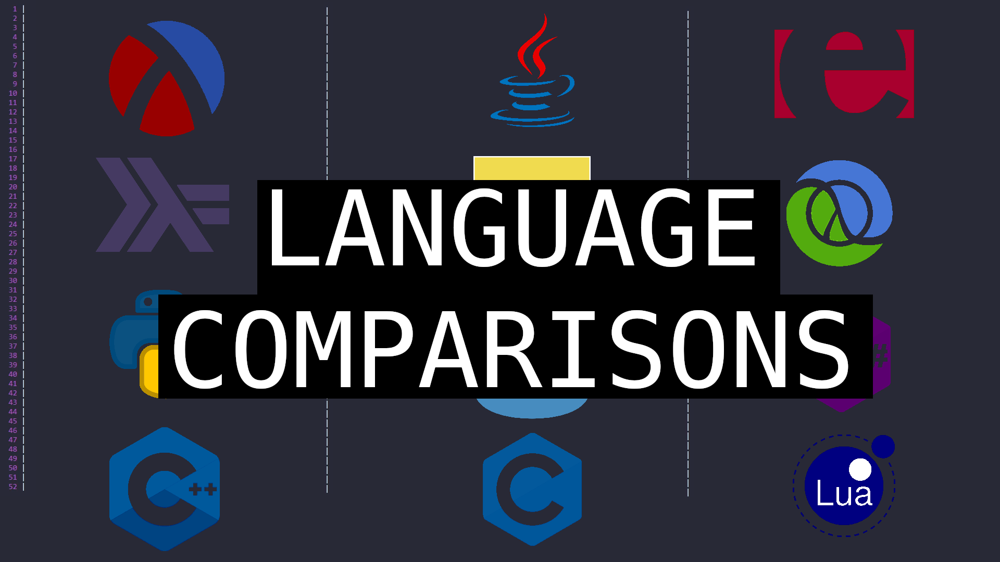

<!-- PROJECT LOGO -->
 

  

  

    A series of shorts comparing how to do common taks in very different languages!
    <!--

    &nbsp;&nbsp;
  
-->

<h3>Episodes</h3>
<ol>
    <li>
      <a href="https://youtu.be/ZQ2R1dOnLBw">Episode 1: Simple Binary Tree in 3 Languages: Lua, Java & Erlang</a>
    </li>
    <li>
      <a href="https://youtu.be/Z1za5EpTVl4">Episode 2: For Loops in 3 Languages: Lua, Java & Erlang</a>
    </li>
    <li>
      <a href="https://youtu.be/D0RF8nboJIo">Episode 3: Parallel Processing in 3 Languages: Python, Java & Erlang</a>
    </li>
    <li>
      <a href="https://youtu.be/-733Ogl-DSM">Episode 4: Fibonacci Sequence in 3 Languages: Lua, Java & Erlang</a>
    </li>
    <li>
      <a href="https://youtu.be/Ds2vrD9Oadw">Episode 5: Map Filter Reduce in 3 Languages: Lua, Java & Erlang</a>
    </li>
    <li>
      <a href="https://youtu.be/xnC7SrCncwE">Episode 6: Publish/Subscribe in 3 Languages: Lua, Java & Erlang</a>
    </li>
 </ol>

